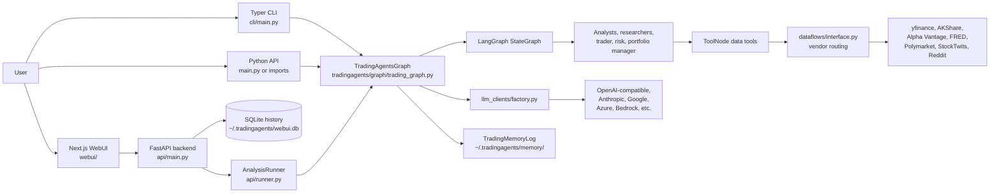
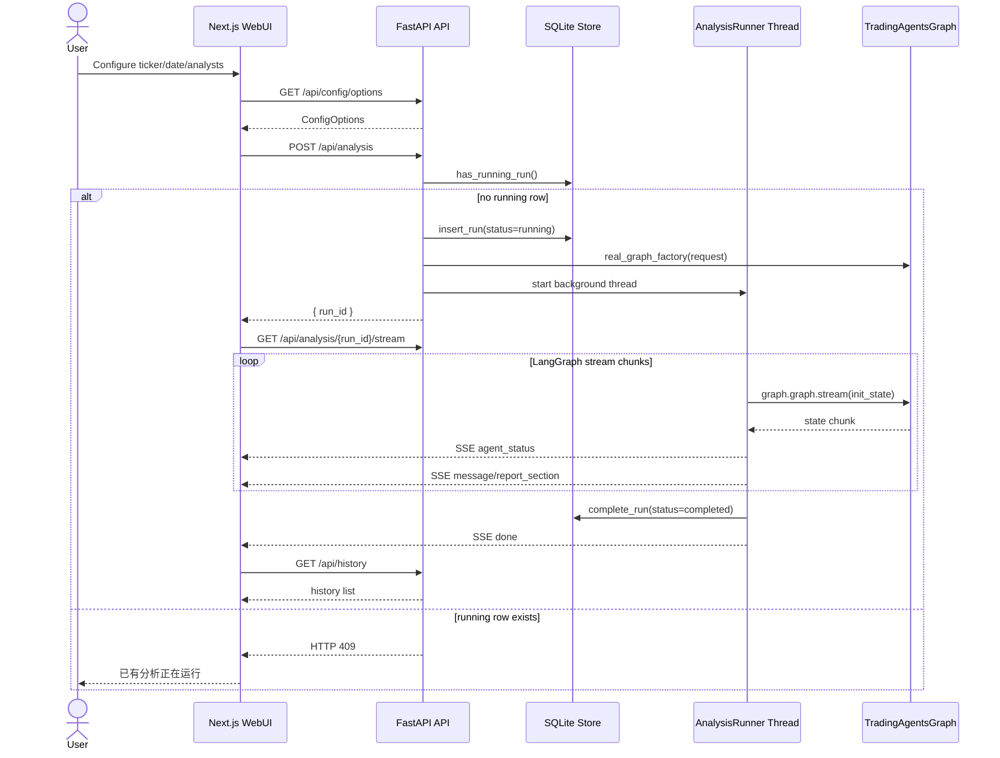
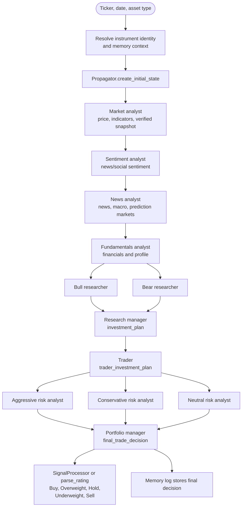
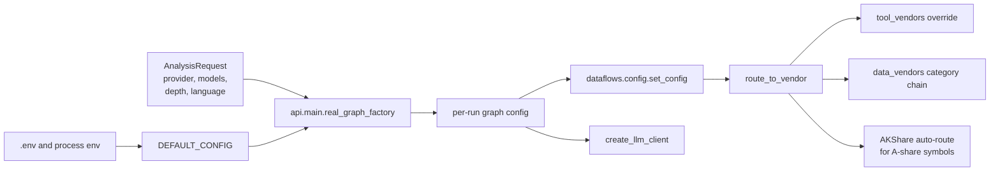
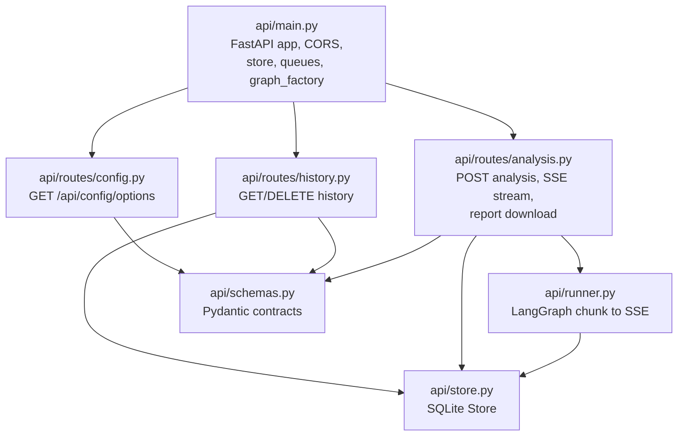
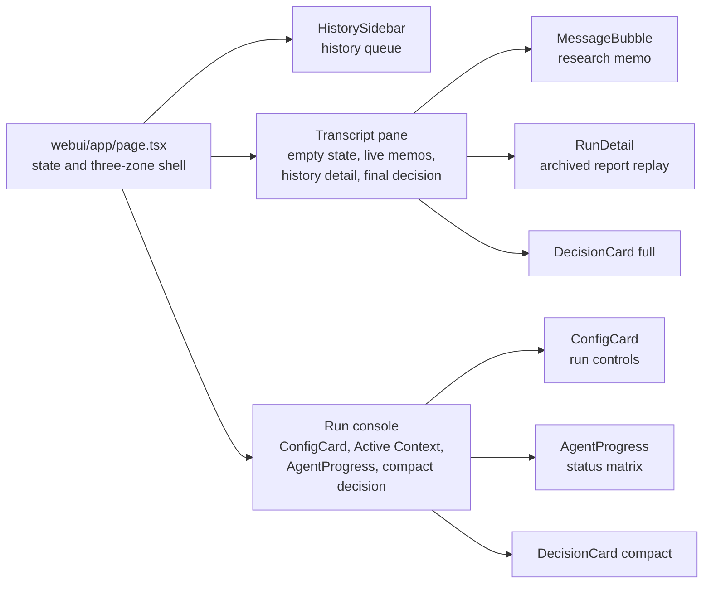
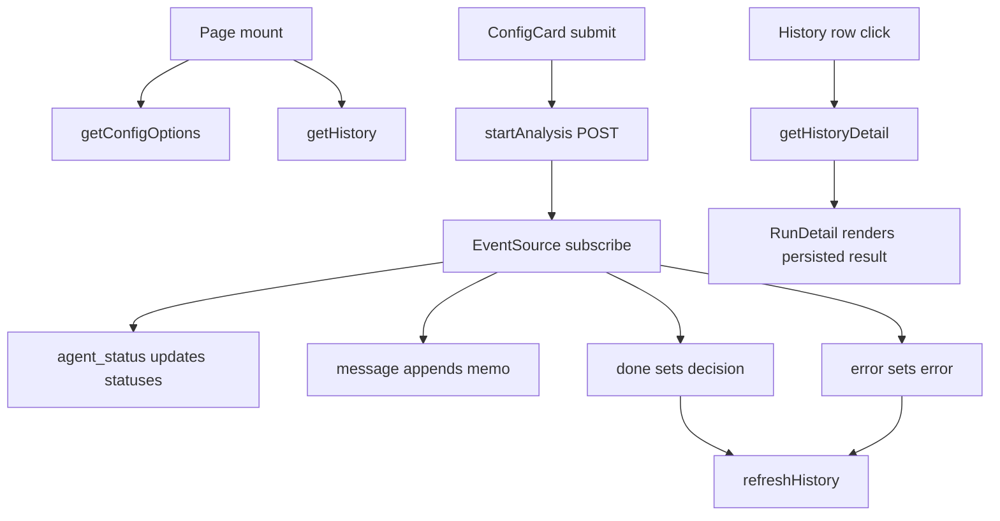

# TradingAgents Architecture And Design

Last updated: 2026-06-17

This document records the current end-to-end architecture and the WebUI design that has landed in code. It is intended for maintainers who need to understand how a ticker analysis moves from the browser, through FastAPI, into the LangGraph multi-agent pipeline, and back to the user as streamed reports and saved history.

## System Overview

TradingAgents is a Python LangGraph trading-research engine with three user-facing entry paths:

- Python package and scripts: direct `TradingAgentsGraph(...).propagate(ticker, date)` calls.
- Typer CLI: interactive terminal workflow and report export.
- WebUI: Next.js frontend plus FastAPI backend, using SSE to stream graph progress.

The WebUI does not reimplement analysis logic. It wraps the Python core, starts one background run at a time, translates LangGraph chunks into SSE events, and stores run history in SQLite.



## WebUI Runtime Flow

The WebUI has two HTTP flows:

- Request and history APIs: normal JSON requests.
- Analysis stream: `POST /api/analysis` creates a run, then `GET /api/analysis/{run_id}/stream` streams SSE events.



### Important Runtime Constraint

The backend is single-user by design. `api.routes.analysis.start_analysis()` rejects a new run when `Store.has_running_run()` finds any row with `status='running'`.

That means an interrupted backend process can leave a stale running row in `~/.tradingagents/webui.db`. In that case the browser may report that an analysis is running even when no process exists. Check with:

```bash
sqlite3 ~/.tradingagents/webui.db \
"select run_id,ticker,trade_date,status,created_at,completed_at from analysis_runs where status='running';"
```

Prefer marking stale rows as `error` rather than deleting them, so history keeps the interruption:

```bash
sqlite3 ~/.tradingagents/webui.db \
"update analysis_runs set status='error', result_json='{\"error\":\"stale running run cleared manually\"}', completed_at=datetime('now') where status='running';"
```

## Core Analysis Pipeline

`TradingAgentsGraph` builds and compiles a LangGraph workflow. The API startup path does not call `propagate()` directly. Instead it creates the same initial state and stream args, then `AnalysisRunner` streams `graph.graph.stream(...)`.



### Graph State Outputs Used By The WebUI

`api/runner.py` maps these state fields into visible WebUI events:

| State field | WebUI agent | Team |
|---|---|---|
| `market_report` | `market_analyst` | analyst |
| `sentiment_report` | `social_analyst` | analyst |
| `news_report` | `news_analyst` | analyst |
| `fundamentals_report` | `fundamentals_analyst` | analyst |
| `investment_plan` | `research_manager` | research |
| `trader_investment_plan` | `trader` | trading |
| `final_trade_decision` | `portfolio_manager` | portfolio |

Each emitted section becomes:

- `agent_status`: marks that agent as `done`.
- `report_section`: raw section event, available for future UI use.
- `message`: report content shown in the transcript.

At completion, `done` includes:

- `decision`: the extracted five-tier decision.
- `final_trade_decision`: portfolio manager markdown.
- `run_id`: persisted run id.

## Data And Configuration Architecture

Runtime configuration starts at `tradingagents/default_config.py`. Environment variables named `TRADINGAGENTS_*` override matching config keys with type-aware coercion. LLM provider keys are loaded through `.env` by `tradingagents/__init__.py`.



### Vendor Routing Rules

Agent code should not call vendor SDKs directly. Tools call `dataflows/interface.py::route_to_vendor()`, which chooses vendors using:

1. Tool-level override in `tool_vendors`.
2. Category-level chain in `data_vendors`.
3. A-share auto-route to AKShare when enabled and supported.
4. Typed no-data handling where vendors raise `NoMarketDataError`.
5. Vendor errors surfaced through ToolNode error handling as source-unavailable text.

For WebUI runs, a vendor outage or missing API key should appear as report context whenever the tool error can be handled. If a stale `running` row exists, that is a store-state issue, not an active graph issue.

## Backend Components



### Backend Responsibilities

| File | Responsibility |
|---|---|
| `api/main.py` | App wiring, CORS, lazy store, graph factory, startup setup |
| `api/routes/analysis.py` | Start one run, expose SSE stream, build markdown report download |
| `api/runner.py` | Execute graph stream in a background thread and push SSE events |
| `api/store.py` | SQLite persistence for run status, config, result, timestamps |
| `api/routes/history.py` | List, detail, and delete persisted runs |
| `api/routes/config.py` | Expose selectable analysts, research depths, language, configured models |

## Frontend Design Landing

The current WebUI design is a research workbench, not a marketing page or consumer finance dashboard.

Physical scene: a trader or quant researcher watches a multi-agent run stream on a dark monitor for several minutes, scanning provenance, status, and final reasoning. This drives a dense dark product interface with restrained semantic color.



### Responsive Layout

Desktop layout:

- Left rail: history queue, fixed 18rem.
- Center pane: research transcript, scrollable, max reading width inside a flexible column.
- Right console: run controls and status, fixed 22rem.

Mobile layout:

1. Active context and run console.
2. Agent matrix.
3. Research transcript.
4. History queue.

The mobile order prioritizes starting or observing a run before browsing history.

### Visual System

Global design tokens live in `webui/app/globals.css`.

| Role | Implementation |
|---|---|
| Surface | OKLCH dark terminal background via `--background` |
| Panels | `--card`, `--sidebar`, `--muted` |
| Text | `--foreground`, `--muted-foreground` |
| Positive/action | `--primary`, emerald-like OKLCH |
| Bearish/error | `--destructive`, red OKLCH |
| Working/warning | amber utility classes |
| Report prose | `.ta-prose` component layer |
| Reduced motion | global `prefers-reduced-motion` media query |

Design constraints:

- Green and red are semantic, not decorative.
- Decision direction is always shown as text, never color alone.
- No gradient text, glass effects, decorative charts, hero-metric blocks, side-stripe card borders, or nested card stacks.
- Monospace labels are used for system state, agent ids, run mode, and compact metadata.
- Sans text is used for readable Chinese and report prose.

### Frontend State Model

`webui/app/page.tsx` owns these state groups:

| State | Purpose |
|---|---|
| `options` | Loaded from `/api/config/options`, feeds `ConfigCard` |
| `history` | Loaded from `/api/history`, feeds `HistorySidebar` |
| `statuses` | Agent status map from SSE `agent_status` |
| `messages` | Live report memo list from SSE `message` |
| `decision` | Final decision and portfolio markdown from SSE `done` |
| `error` | Backend or stream error shown inline |
| `running` | Local run state while SSE is active |
| `selectedId/detail` | History replay mode |

State flow:



## Design-To-Code Map

| Design element | File |
|---|---|
| Three-zone workbench shell | `webui/app/page.tsx` |
| Terminal OKLCH palette and prose rules | `webui/app/globals.css` |
| Run configuration console | `webui/components/ConfigCard.tsx` |
| Agent status matrix | `webui/components/AgentProgress.tsx` |
| History queue rail | `webui/components/HistorySidebar.tsx` |
| Streamed research memo | `webui/components/MessageBubble.tsx` |
| Final and compact decision output | `webui/components/DecisionCard.tsx` |
| Archived run replay | `webui/components/RunDetail.tsx` |
| API client calls | `webui/lib/api.ts` |
| SSE subscription | `webui/lib/sse.ts` |

## Operational Commands

Backend:

```bash
uvicorn api.main:app --reload --port 8000
```

Frontend:

```bash
cd webui
npm run dev
```

Verification:

```bash
cd webui
npm run lint
npm run build
```

Core test suite:

```bash
pytest
```

Focused WebUI backend tests:

```bash
pytest tests/webui/
```

## Current Caveats

- The backend single-run invariant is database-based. A crashed process can leave a stale `running` row that blocks new runs until marked `error` or deleted.
- A-share and China ETF data can depend on AKShare. In environments where AKShare is unavailable or blocked, yfinance may be usable for some `.SZ` ETF price data, but this should be a deliberate config choice.
- WebUI history stores results in `~/.tradingagents/webui.db`; deleting the database clears WebUI history only, not memory logs.
- The frontend is dark-only by design for the current research workbench.
- `report_section` SSE events are emitted but the current UI primarily renders the `message` event shape.
