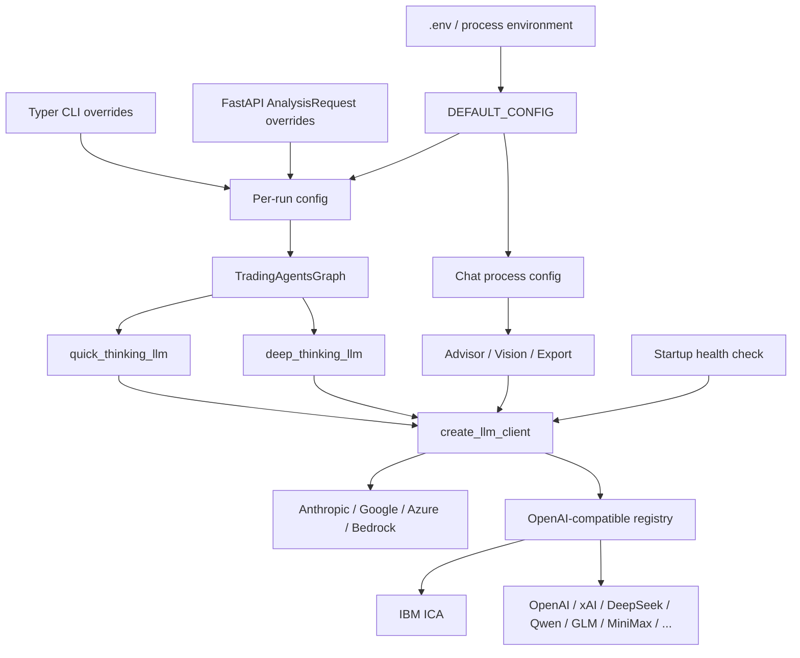

# TradingAgents LLM API 架构与调用参考

最后更新：2026-06-24

本文面向维护 TradingAgents Python 核心、CLI、FastAPI 和 Chat 功能的开发者，记录项目中所有会触发 LLM API 的路径、模型分配、Provider 接入、鉴权、重试、结构化输出和运行时差异。

本文只讨论语言模型调用。行情、新闻、社交媒体和宏观数据等外部数据 API 由 `tradingagents/dataflows/` 管理，不属于本文范围。

## 1. 当前默认配置

`tradingagents/default_config.py` 当前默认值如下：

| 配置 | 默认值 | 用途 |
|---|---|---|
| `llm_provider` | `ibm_ica` | 快、深两档模型共用的 Provider |
| `quick_think_llm` | `claude-haiku-4-5` | 高频分析、工具调用、辩论、Chat |
| `deep_think_llm` | `claude-opus-4-8` | Research Manager 和 Portfolio Manager |
| `backend_url` | `None` | `None` 时使用 Provider 自己的默认端点 |
| `temperature` | `None` | 不显式发送，交给 Provider 默认值 |
| `google_thinking_level` | `None` | Gemini 专用 thinking 配置 |
| `openai_reasoning_effort` | `None` | 原生 OpenAI 专用 reasoning effort |
| `anthropic_effort` | `None` | 原生 Anthropic Opus/Sonnet 专用 effort |

当前 IBM ICA 的默认请求关系为：

```text
provider:  ibm_ica
quick:     claude-haiku-4-5
deep:      claude-opus-4-8
base URL:  https://api.nextgen-beta.ica.ibm.com/ica/v1/chat-models
request:   POST .../ica/v1/chat-models/chat/completions
auth:      Authorization: Bearer $IBM_ICA_API_KEY
```

模型 ID 必须使用 ICA 接受的裸名，例如 `claude-opus-4-8`，不能写成 `ibm_ica/claude-opus-4-8`。

## 2. 总体调用架构



所有业务代码都应通过：

```python
from tradingagents.llm_clients import create_llm_client

client = create_llm_client(
    provider=config["llm_provider"],
    model=config["quick_think_llm"],
    base_url=config.get("backend_url"),
)
llm = client.get_llm()
```

不要在 Agent、Chat 或脚本中直接实例化 `ChatOpenAI`、`ChatAnthropic` 等 SDK 类。统一工厂负责 Provider 分派、端点、鉴权、内容归一化和 Provider 特殊兼容逻辑。

## 3. 配置和鉴权加载顺序

### 3.1 环境文件

导入 `tradingagents` 时会依次加载：

1. 从当前工作目录向上查找的 `.env`。
2. `.env.enterprise`，且不会覆盖已经存在的环境变量。

进程启动前显式导出的环境变量优先级最高，因为 `load_dotenv()` 使用 `override=False`。

### 3.2 `TRADINGAGENTS_*` 配置覆盖

| 环境变量 | 配置键 |
|---|---|
| `TRADINGAGENTS_LLM_PROVIDER` | `llm_provider` |
| `TRADINGAGENTS_DEEP_THINK_LLM` | `deep_think_llm` |
| `TRADINGAGENTS_QUICK_THINK_LLM` | `quick_think_llm` |
| `TRADINGAGENTS_LLM_BACKEND_URL` | `backend_url` |
| `TRADINGAGENTS_TEMPERATURE` | `temperature` |

环境覆盖在 `DEFAULT_CONFIG` 模块导入时应用。修改 `.env` 后，已经运行的 Python/FastAPI 进程不会自动重新加载，必须重启。

### 3.3 API Key 映射

| Provider | Key / 凭据 |
|---|---|
| `openai` | `OPENAI_API_KEY` |
| `anthropic` | `ANTHROPIC_API_KEY` |
| `google` | `GOOGLE_API_KEY` |
| `azure` | `AZURE_OPENAI_API_KEY`，并使用 Azure endpoint/deployment/version 环境变量 |
| `xai` | `XAI_API_KEY` |
| `deepseek` | `DEEPSEEK_API_KEY` |
| `qwen` / `qwen-cn` | `DASHSCOPE_API_KEY` / `DASHSCOPE_CN_API_KEY` |
| `glm` / `glm-cn` | `ZHIPU_API_KEY` / `ZHIPU_CN_API_KEY` |
| `minimax` / `minimax-cn` | `MINIMAX_API_KEY` / `MINIMAX_CN_API_KEY` |
| `openrouter` | `OPENROUTER_API_KEY` |
| `mistral` | `MISTRAL_API_KEY` |
| `kimi` | `MOONSHOT_API_KEY` |
| `groq` | `GROQ_API_KEY` |
| `nvidia` | `NVIDIA_API_KEY` |
| `ibm_ica` | `IBM_ICA_API_KEY` |
| `openai_compatible` | 可选 `OPENAI_COMPATIBLE_API_KEY` |
| `ollama` | 不要求 Key，客户端发送占位值 `ollama` |
| `bedrock` | AWS 标准凭据链和 `AWS_REGION` / `AWS_DEFAULT_REGION` |

CLI 的 `ensure_api_key()` 会在必需 Key 缺失时交互询问，并把 Key 保存到 `.env`。`openai_compatible` 和 `ollama` 不会强制询问。

## 4. Provider 参考

### 4.1 原生协议 Provider

| Provider | LangChain 客户端 | 协议和说明 |
|---|---|---|
| `anthropic` | `ChatAnthropic` | Anthropic Messages API；仅 Opus/Sonnet 型号接收 `effort` |
| `google` | `ChatGoogleGenerativeAI` | Gemini API；Gemini 3 使用 `thinking_level`，旧型号映射为 `thinking_budget` |
| `azure` | `AzureChatOpenAI` | Azure OpenAI deployment API；deployment 默认回退到模型名 |
| `bedrock` | `ChatBedrockConverse` | Amazon Bedrock Converse API；需要可选依赖 `.[bedrock]` |

这四类先由 `factory.py` 分派，不进入 OpenAI-compatible 注册表。

### 4.2 OpenAI-compatible Provider

| Provider | 默认 Base URL | 备注 |
|---|---|---|
| `openai` | SDK 默认 OpenAI 地址 | 原生地址使用 Responses API；自定义地址回退 Chat Completions |
| `xai` | `https://api.x.ai/v1` | Chat Completions |
| `deepseek` | `https://api.deepseek.com` | 处理 reasoning content 回传和 `tool_choice` 限制 |
| `qwen` | `https://dashscope-intl.aliyuncs.com/compatible-mode/v1` | 国际账号 |
| `qwen-cn` | `https://dashscope.aliyuncs.com/compatible-mode/v1` | 中国账号 |
| `glm` | `https://api.z.ai/api/paas/v4/` | Z.AI 国际端点 |
| `glm-cn` | `https://open.bigmodel.cn/api/paas/v4/` | BigModel 中国端点 |
| `minimax` | `https://api.minimax.io/v1` | M2.x 自动发送 `reasoning_split` |
| `minimax-cn` | `https://api.minimaxi.com/v1` | 中国端点 |
| `openrouter` | `https://openrouter.ai/api/v1` | 模型 ID 由用户提供 |
| `mistral` | `https://api.mistral.ai/v1` | 模型 ID 由用户提供 |
| `kimi` | `https://api.moonshot.ai/v1` | Moonshot API |
| `groq` | `https://api.groq.com/openai/v1` | 模型 ID 由用户提供 |
| `nvidia` | `https://integrate.api.nvidia.com/v1` | NVIDIA NIM |
| `ollama` | `http://localhost:11434/v1` | 可用 `OLLAMA_BASE_URL` 覆盖 |
| `ibm_ica` | `https://api.nextgen-beta.ica.ibm.com/ica/v1/chat-models` | ICA 业务层 Chat Completions |
| `openai_compatible` | 无 | 必须提供 `backend_url` |

OpenAI-compatible Base URL 的优先级是：

```text
create_llm_client(base_url=...)
→ Provider 专用环境变量，如 IBM_ICA_BASE_URL / OLLAMA_BASE_URL
→ 注册表默认 URL
```

`TRADINGAGENTS_LLM_BACKEND_URL` 会进入第一级，因此会覆盖 `IBM_ICA_BASE_URL`。

## 5. IBM ICA 专项说明

### 5.1 API 请求

WebUI 和直接 Python 调用在没有 `backend_url` 覆盖时使用：

```http
POST /ica/v1/chat-models/chat/completions HTTP/1.1
Host: api.nextgen-beta.ica.ibm.com
Authorization: Bearer <IBM_ICA_API_KEY>
Content-Type: application/json

{
  "model": "claude-haiku-4-5",
  "messages": [
    {"role": "system", "content": "..."},
    {"role": "user", "content": "..."}
  ],
  "tools": []
}
```

`tools`、`tool_choice`、结构化输出相关字段是否出现，取决于具体 Agent 调用方式。

### 5.2 当前 ICA 模型目录

| 槽位 | 模型候选顺序 |
|---|---|
| quick | `claude-haiku-4-5`、`claude-sonnet-4-6`、`gpt-5.1-chat-gus`、`ibm/granite-4-h-small` |
| deep | `claude-opus-4-8`、`claude-opus-4-7`、`claude-sonnet-4-6`、`gpt-5.4-gus`、`gemini-3.1-pro-preview` |

ICA 被列入“接受任意模型 ID”的 Provider。客户端不会在本地阻止自定义 ID，最终由网关决定是否存在。

### 5.3 ICA 特殊错误处理

`IbmIcaChatOpenAI` 处理两种网关错误：

- `Model not found`：转换成包含被拒绝模型名的错误，并额外请求 `{base_url}/models`，尽力列出当前模型。
- Guardrail `E001`：标记为 ICA guardrail 子系统故障，而不是错误模型 ID，建议重试或切换模型家族。

模型列表请求只发生在 `Model not found` 错误之后，不是每次推理前都请求。

### 5.4 CLI 与 WebUI 的端点差异

当前代码存在一个需要维护者知晓的端点差异：

| 入口 | IBM ICA Base URL 来源 | 当前值 |
|---|---|---|
| WebUI / Python 默认配置 | `OPENAI_COMPATIBLE_PROVIDERS` | `.../ica/v1/chat-models` |
| 交互式 CLI | `cli.utils._llm_provider_table()` | `.../ica/v1` |

CLI 会把菜单中的 URL 写入 `config["backend_url"]`，其优先级高于 Provider 注册表，所以交互式 CLI 实际会请求 `.../ica/v1/chat/completions`。这与 README 和 WebUI 默认的业务层 `/chat-models` 端点不同。本文记录现状，不把二者描述成同一条链路。

## 6. TradingAgents 模型分配

`TradingAgentsGraph` 为每次运行创建一个 quick 实例和一个 deep 实例。所有节点复用这两个实例。

| 组件 | 模型槽位 | API 方式 |
|---|---|---|
| Market Analyst | quick | `bind_tools()` + `invoke()` |
| Sentiment Analyst | quick | 结构化输出；失败时 free-text |
| News Analyst | quick | `bind_tools()` + `invoke()` |
| Fundamentals Analyst | quick | `bind_tools()` + `invoke()` |
| Bull Researcher | quick | 普通 `invoke()` |
| Bear Researcher | quick | 普通 `invoke()` |
| Research Manager | deep | 结构化输出；失败时 free-text |
| Trader | quick | 结构化输出；失败时 free-text |
| Aggressive Risk Analyst | quick | 普通 `invoke()` |
| Conservative Risk Analyst | quick | 普通 `invoke()` |
| Neutral Risk Analyst | quick | 普通 `invoke()` |
| Portfolio Manager | deep | 结构化输出；失败时 free-text |
| Deferred Reflection | quick | 普通 `invoke()` |
| SignalProcessor | 不使用 LLM | 本地解析 Portfolio Manager 的 rating |

因此，当前默认设置下只有 Research Manager 和 Portfolio Manager 使用 `claude-opus-4-8`。研究员辩论、Trader 和三位风险分析师都使用 `claude-haiku-4-5`。

### 6.1 Agent 工具循环

Market、News 和 Fundamentals Analyst 的 LLM 可以返回 tool calls。LangGraph 执行工具后返回同一个 Agent，再发起下一次 LLM 请求，直到模型返回不包含 tool call 的最终报告。

```text
Agent LLM request
  ├─ returns tool_calls → ToolNode → append ToolMessage → Agent LLM request
  └─ returns text       → save report → next graph stage
```

每个工具轮次都会产生一次新的模型 API 请求，所以一次分析的调用次数不是固定值。

Sentiment Analyst 是例外：它在调用 LLM 前同步预取新闻、StockTwits 和 Reddit 内容，然后把数据直接放进 prompt，不运行 LLM tool loop。

### 6.2 辩论轮次

以下配置会直接增加模型调用次数：

- `max_debate_rounds`：增加 Bull/Bear 交替调用。
- `max_risk_discuss_rounds`：增加三位风险分析师交替调用。
- 选择更多 Analyst：增加分析节点及其工具循环。

### 6.3 反思记忆

直接调用 `TradingAgentsGraph.propagate()` 时，新一轮同 ticker 分析会尝试解析历史 pending 决策。如果已能取得真实收益，每条可解析记录会触发一次 quick 模型反思调用，并把 2 到 4 句反思写回 memory log。

FastAPI 的 `real_graph_factory()` 当前手工创建初始状态，没有调用 `_resolve_pending_entries()`，所以 WebUI 分析路径不会触发这类延迟反思调用。

## 7. 结构化输出

以下四个组件使用 Pydantic schema：

| 组件 | Schema | 主要输出 |
|---|---|---|
| Sentiment Analyst | `SentimentReport` | band、score、confidence、narrative |
| Research Manager | `ResearchPlan` | recommendation、rationale、actions |
| Trader | `TraderProposal` | Buy/Hold/Sell、价格、止损、仓位 |
| Portfolio Manager | `PortfolioDecision` | 五档 rating、摘要、投资逻辑、目标价 |

调用流程：

```text
llm.with_structured_output(Schema)
  → structured_llm.invoke(prompt)
  → Pydantic object
  → render_*() 转换成 Markdown
```

如果 Provider 不支持 `with_structured_output()`，初始化阶段直接使用 free-text。如果结构化调用本身失败，会再调用一次普通 `llm.invoke(prompt)`。因此一次结构化失败可能产生两次计费请求。

OpenAI-compatible 模型由 `capabilities.py` 决定结构化方式：

- 默认使用 function calling。
- DeepSeek thinking/reasoner 和 MiniMax M2.x 仍发送 tools schema，但抑制不兼容的 `tool_choice`。
- MiniMax M2.x 额外发送 `reasoning_split=true`。
- DeepSeek reasoning content 会在下一轮 assistant message 中原样带回。

## 8. Chat、视觉和导出调用

### 8.1 Chat 绑定的模型

`real_chat_llm_factory()` 每次从进程级 `DEFAULT_CONFIG` 读取：

```python
provider = config["llm_provider"]
model = config["quick_think_llm"]
```

Chat 不使用 `deep_think_llm`，也不继承某个历史分析请求曾经覆盖的模型。当前默认是 `ibm_ica / claude-haiku-4-5`。

同一个 quick 模型同时用于：

- Advisor 对话和工具选择。
- 每张持仓截图的视觉识别。
- 导出 Chat 报告时的结论总结。

Chat 工厂当前没有转发 `temperature`、`google_thinking_level`、`openai_reasoning_effort` 或 `anthropic_effort`。这些配置只由 `TradingAgentsGraph._get_provider_kwargs()` 应用于分析图。

### 8.2 Advisor 工具循环

Chat 首次调用后最多执行 6 个工具轮次：

```text
initial invoke
→ tool calls
→ execute tools
→ append ToolMessage
→ invoke again
→ ... at most 6 rounds
```

因此单条 Chat 消息最多触发 7 次外层 LLM 请求。一次响应中可以调用多个工具，但同一轮的所有工具执行完成后只追加一次后续 LLM 请求。

### 8.3 报告导出

`export_chat_report` 是 Chat 可调用工具。工具内部会额外调用同一个 LLM，把完整对话中已经确认、且属于指定 scope 的结论整理成 Markdown。因此一次导出至少包含：

1. 外层 Chat 选择导出工具的请求。
2. 工具内部的总结请求。
3. 工具结果回传后的外层 Chat 请求。

如果 scope 不明确，模型可以先调用 `request_export_scope`，等待用户确认后再导出。

### 8.4 持仓截图

每张上传图片触发一次 `vision_llm.invoke()`：

```text
HumanMessage.content = [
  {type: "image_url", image_url: {url: "data:<mime>;base64,..."}},
  {type: "text", text: extraction_instruction}
]
```

多图上传按顺序逐张调用，不做批量模型请求。当前 `vision_llm` 只是 `chat_llm` 的别名，代码没有独立的视觉模型能力检查；配置的 quick 模型必须实际支持图片输入。

## 9. 健康检查和隐含调用成本

FastAPI 启动时默认执行模型健康检查，除非设置：

```bash
TRADINGAGENTS_STARTUP_MODEL_CHECK=0
```

健康检查会对 quick、deep 两个槽位的所有候选模型分别发送一个内容为 `ping` 的真实 `invoke()`，不是只探测当前模型。

IBM ICA 默认目录包含 4 个 quick 候选和 5 个 deep 候选，因此一次 FastAPI 启动通常产生 9 次模型请求。`claude-sonnet-4-6` 同时存在于两个槽位，会被分别探测。

选择规则：

1. 配置模型优先。
2. 配置模型失败时，选择目录中第一个成功的候选。
3. 全部失败时保留原配置，记录 `all_failed`，但不阻止服务启动。
4. 选择结果写回进程内的 `DEFAULT_CONFIG`，后续 WebUI 分析和 Chat 都会使用新值。

这项检查只在 FastAPI startup 中自动执行。CLI 和普通 Python 导入不会自动运行它。

## 10. 重试、降级和额外请求

| 条件 | 行为 | 最多增加的请求 |
|---|---|---|
| OpenAI-compatible 成功响应被 SDK 解析为 `None` | 自动重试一次 | 1 次推理 |
| 结构化输出调用失败 | 改用 free-text 再调用一次 | 1 次推理 |
| ICA 返回 `Model not found` | 请求 `{base_url}/models` 丰富错误 | 1 次非推理 GET |
| Agent 返回 tool calls | 执行工具后再次调用 | 每轮 1 次推理 |
| Chat 返回 tool calls | 最多 6 个工具轮次 | 最多 6 次推理 |

普通 Provider 异常不会被吞掉。TradingAgents 分析会最终进入 run error；Chat 会转换成 SSE `error` 事件。

## 11. “流式输出”的准确含义

项目中的两个 SSE 界面都不等于底层 Provider token streaming：

### 分析页面

`api/runner.py` 调用的是 `graph.graph.stream()`。它流式发送 LangGraph 节点完成和报告 section，但节点内部仍使用同步 `llm.invoke()`。用户会在每个 Agent 完成后看到报告，不会逐 token 看到模型生成过程。

### Chat 页面

`advisor/engine.py` 先通过同步 `chain.invoke()` 得到完整文本，再每 24 个字符发送一个 `token` SSE 事件：

```python
for i in range(0, len(text), 24):
    yield {"event": "token", "data": {"content": text[i:i + 24]}}
```

这是一种 UI 分块，不是 Provider streaming。当前模型客户端没有为业务调用设置 `stream=True`，也没有使用 `llm.stream()`。

## 12. 可观测性

FastAPI 分析请求会给 quick/deep 模型挂载 `RunTelemetryCallback`，记录：

- 当前活跃 LLM 调用数。
- 最近一次调用开始、结束和错误时间。
- 最近模型名。
- prompt 前 1,200 字符和 prompt 总字符数。
- 最近完成的报告 section。

查询接口：

```http
GET /api/analysis/{run_id}/status
```

Telemetry 只存在内存中，不会记录 token usage 或费用。Chat 工厂当前没有挂载该 callback，所以 Chat、视觉和 Chat 导出调用不会出现在这个状态接口里。

prompt preview 可能包含报告、用户输入和业务上下文。若未来持久化或外发 telemetry，必须先定义脱敏策略。

## 13. 如何配置和验证

### 13.1 配置 IBM ICA

在 `.env` 中填写占位示例对应的真实值，不要把 Key 写入代码或文档：

```dotenv
IBM_ICA_API_KEY=<your-ica-rest-api-key>
TRADINGAGENTS_LLM_PROVIDER=ibm_ica
TRADINGAGENTS_DEEP_THINK_LLM=claude-opus-4-8
TRADINGAGENTS_QUICK_THINK_LLM=claude-haiku-4-5
```

只在租户端点不同时覆盖：

```dotenv
IBM_ICA_BASE_URL=https://your-tenant.example/ica/v1/chat-models
```

不要同时设置一个不同的 `TRADINGAGENTS_LLM_BACKEND_URL`，因为它的优先级更高。

### 13.2 无网络验证解析结果

下面的命令只构造客户端，不发送模型请求：

```bash
.venv/bin/python - <<'PY'
from tradingagents.default_config import DEFAULT_CONFIG
from tradingagents.llm_clients import create_llm_client

for slot in ("quick_think_llm", "deep_think_llm"):
    llm = create_llm_client(
        DEFAULT_CONFIG["llm_provider"],
        DEFAULT_CONFIG[slot],
        DEFAULT_CONFIG.get("backend_url"),
    ).get_llm()
    print(slot, type(llm).__name__, llm.model_name, llm.openai_api_base)
PY
```

不要打印 `openai_api_key` 或整个客户端对象。

### 13.3 真实结构化输出 smoke

```bash
.venv/bin/python scripts/smoke_structured_output.py ibm_ica
```

该脚本会发送真实、可能计费的 Provider 请求，要求有效 Key。默认 `pytest` 不会运行它。

### 13.4 单元测试

```bash
pytest tests/test_openai_compatible_provider.py \
       tests/test_model_health_check.py \
       tests/test_structured_agents.py \
       tests/advisor/test_vision.py
```

这些测试使用 mock，不需要真实 LLM Key。

## 14. 如何扩展 Provider 或模型

### 新增 OpenAI-compatible Provider

1. 在 `OPENAI_COMPATIBLE_PROVIDERS` 注册 Base URL、环境覆盖和必要的 client subclass。
2. 在 `PROVIDER_API_KEY_ENV` 注册 Key 环境变量。
3. 在 `MODEL_OPTIONS` 注册 quick/deep 模型，或使用 custom-only。
4. 若模型有参数限制，在 `capabilities.py` 声明，不要在 Agent 中写模型名判断。
5. 在 CLI Provider 表注册显示名称和入口 URL。
6. 为 endpoint、鉴权、结构化输出和特殊错误增加单元测试。

### 新增原生 Provider

1. 新建继承 `BaseLLMClient` 的客户端模块。
2. 在 `factory.py` 的原生分派分支注册。
3. 对多块内容进行 `normalize_content()`，保证下游读取到字符串。
4. 明确 SDK 的凭据链、thinking/reasoning 参数和结构化输出能力。

### 新增模型

模型目录 `model_catalog.py` 是 CLI 选择和健康检查候选的单一来源。ICA、Ollama、OpenRouter 等允许自定义 ID 的 Provider 不做本地硬校验，但目录候选仍会影响 FastAPI 启动时实际发送的健康检查请求数量。

## 15. 安全和运维注意事项

- `.env` 和 `.env.enterprise` 必须保持在 `.gitignore` 中。
- 日志和文档中只记录 Key 是否存在，绝不记录其值。
- 不要把包含 base64 图片的视觉请求完整写入日志。
- FastAPI 默认健康检查会产生真实外部请求和潜在费用。
- Chat 历史和分析报告会进入后续 prompt，应按发送给第三方模型 Provider 的数据处理。
- API status 的 prompt preview 当前保留在内存，仍可能包含敏感业务上下文。
- `temperature=0` 不能保证确定性；Provider、工具数据和模型内部推理仍可能变化。
- `openai_compatible` 指向本地服务时可以无 Key，但指向远程 relay 时应设置 `OPENAI_COMPATIBLE_API_KEY`。

## 16. 主要源码索引

| 文件 | 责任 |
|---|---|
| `tradingagents/default_config.py` | LLM 默认配置和环境覆盖 |
| `tradingagents/__init__.py` | `.env` / `.env.enterprise` 加载 |
| `tradingagents/llm_clients/factory.py` | Provider 总入口 |
| `tradingagents/llm_clients/openai_client.py` | OpenAI-compatible 注册表和 IBM ICA 逻辑 |
| `tradingagents/llm_clients/api_key_env.py` | Provider 到 Key 环境变量映射 |
| `tradingagents/llm_clients/model_catalog.py` | CLI 模型目录和健康检查候选 |
| `tradingagents/llm_clients/capabilities.py` | 模型参数和结构化输出能力 |
| `tradingagents/llm_clients/health_check.py` | 启动探测和模型回退 |
| `tradingagents/graph/trading_graph.py` | quick/deep 客户端创建和 Provider 参数 |
| `tradingagents/graph/setup.py` | Agent 到 quick/deep 的实际绑定 |
| `tradingagents/agents/utils/structured.py` | 结构化调用和 free-text 降级 |
| `tradingagents/agents/schemas.py` | LLM 结构化输出 schema |
| `tradingagents/graph/reflection.py` | 延迟反思调用 |
| `api/main.py` | WebUI 分析和 Chat 模型工厂 |
| `api/routes/chat.py` | Chat、视觉和导出接线 |
| `tradingagents/advisor/engine.py` | Chat 工具循环和 SSE 分块 |
| `tradingagents/advisor/vision.py` | 图片消息和持仓解析 |
| `tradingagents/advisor/export.py` | Chat 报告总结调用 |
| `api/telemetry.py` | 分析 LLM callback 可观测性 |
| `scripts/smoke_structured_output.py` | 真实 Provider smoke 测试 |
