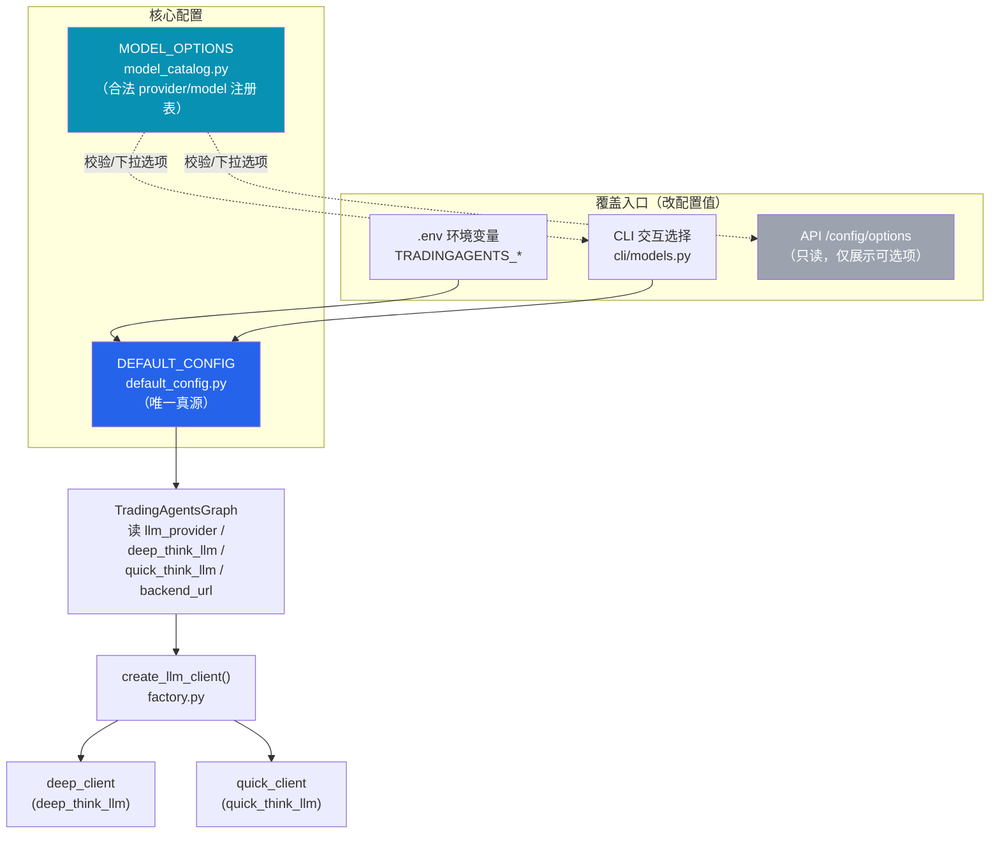
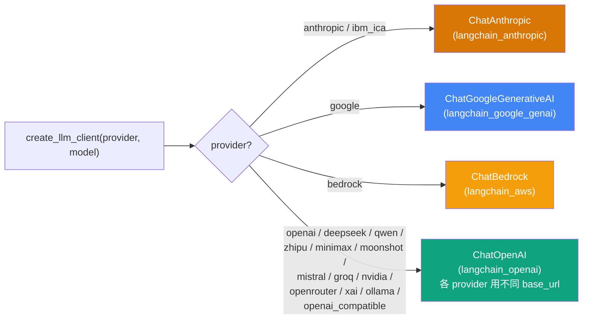

# LLM 模型配置说明

本文档说明 TradingAgents 里 **LLM 模型是在哪里配置的、如何生效、怎么修改**。

---

## 一、当前默认配置（速览）

配置的唯一来源是 [`tradingagents/default_config.py`](../tradingagents/default_config.py) 里的 `DEFAULT_CONFIG`。当前默认值：

| 配置项 | 默认值 | 含义 |
|---|---|---|
| `llm_provider` | `ibm_ica` | 用哪个厂商/网关 |
| `deep_think_llm` | `claude-opus-4-8` | 深度思考模型（研究经理、交易员、组合经理等重推理节点） |
| `quick_think_llm` | `claude-haiku-4-5` | 快速思考模型（分析师工具循环等高频节点） |
| `backend_url` | `None` | 自定义 endpoint；`None` 时各厂商用自己的默认地址 |
| `temperature` | `None` | 采样温度；`None` 用厂商默认 |
| `llm_max_retries` | `6` | 瞬时失败（5xx/429）重试次数 |
| `llm_request_timeout` | `300` | 单次请求超时（秒） |
| `google_thinking_level` | `None` | Gemini 思考强度 |
| `openai_reasoning_effort` | `None` | OpenAI 推理强度 |
| `anthropic_effort` | `None` | Claude 推理强度 |

> 系统用**两个模型**跑整条流水线：`deep_think_llm` 负责重推理节点，`quick_think_llm` 负责高频轻量节点，以此平衡质量与成本。

---

## 二、配置是怎么生效的

模型配置分三层：**定义 → 注册（校验）→ 消费**，外加三个**覆盖入口**。



- **定义**：[`default_config.py`](../tradingagents/default_config.py) 的 `DEFAULT_CONFIG` —— 唯一真源。
- **注册/校验**：[`model_catalog.py`](../tradingagents/llm_clients/model_catalog.py) 的 `MODEL_OPTIONS` —— 规定「哪些 provider、哪些 model 名合法」，供 CLI 下拉、API 展示、校验使用。新增模型必须在这里登记。
- **消费**：[`trading_graph.py`](../tradingagents/graph/trading_graph.py) 只读 `llm_provider / deep_think_llm / quick_think_llm / backend_url` 四个键，交给 [`create_llm_client()`](../tradingagents/llm_clients/factory.py) 实例化出 `deep_client` 和 `quick_client`。
- **覆盖入口**：`.env`、CLI 交互、API（API 目前**只读**，不写回配置）。

---

## 三、如何修改配置

### 方式 1：`.env`（推荐，无需改代码）

`.env` 里凡是 `TRADINGAGENTS_*` 变量，会覆盖 `DEFAULT_CONFIG` 里的同名键（映射表见 `default_config.py` 的 `_ENV_OVERRIDES`）。**注意：只有在这张白名单里的键才能用 `.env` 配。**

| 想配的东西 | `.env` 变量 | 能否用 .env |
|---|---|---|
| 各厂商 API Key | `OPENAI_API_KEY` / `ANTHROPIC_API_KEY` / `IBM_ICA_API_KEY` … | ✅ |
| 选哪个 provider | `TRADINGAGENTS_LLM_PROVIDER` | ✅ |
| 深/快思考模型 | `TRADINGAGENTS_DEEP_THINK_LLM` / `TRADINGAGENTS_QUICK_THINK_LLM` | ✅ |
| 自定义 endpoint | `TRADINGAGENTS_LLM_BACKEND_URL` | ✅ |
| 温度 / 重试 / 超时 | `TRADINGAGENTS_TEMPERATURE` / `TRADINGAGENTS_LLM_MAX_RETRIES` / `TRADINGAGENTS_LLM_REQUEST_TIMEOUT` | ✅ |
| **思考强度** `google_thinking_level` / `openai_reasoning_effort` / `anthropic_effort` | — | ❌ 未在 `_ENV_OVERRIDES` 白名单里 |

示例 `.env`：

```bash
# 用 Anthropic 官方 Claude
ANTHROPIC_API_KEY=sk-ant-xxx
TRADINGAGENTS_LLM_PROVIDER=anthropic
TRADINGAGENTS_DEEP_THINK_LLM=claude-opus-4-8
TRADINGAGENTS_QUICK_THINK_LLM=claude-haiku-4-5
```

### 方式 2：CLI 交互选择

运行 `tradingagents` 时会交互式选择 provider、深/快模型（选项来自 `MODEL_OPTIONS`）。若已在 `.env` 设了对应 `TRADINGAGENTS_*`，则**跳过**对应的交互步骤。

### 方式 3：代码里传 config

`TradingAgentsGraph(config=...)` 传入的 config 会深合并进全局配置。

---

## 四、Provider 是怎么分派到具体 SDK 的

`create_llm_client()` 按 `provider` 分派。**Anthropic / Google / Bedrock 用各自专用类，其余全部走 OpenAI 兼容协议（`ChatOpenAI` + 各自 base_url）。**



> `ibm_ica`（默认 provider）走 Anthropic Messages API，用 `IBM_ICA_API_KEY` 作为 `x-api-key`。

---

## 五、支持的 Provider 一览

来自 `MODEL_OPTIONS` / `PROVIDER_LABELS`，共 **17 个**：

| Provider key | 名称 | 代表模型（部分） |
|---|---|---|
| `openai` | OpenAI | `gpt-4o`, `gpt-4.1`, `o3`, `o4-mini` |
| `anthropic` | Anthropic (Claude) | `claude-opus-4-8`, `claude-haiku-4-5`, `claude-sonnet-4-5` |
| `google` | Google (Gemini) | `gemini-2.5-pro`, `gemini-2.5-flash` |
| `xai` | xAI (Grok) | `grok-4`, `grok-3` |
| `deepseek` | DeepSeek | `deepseek-chat`, `deepseek-reasoner` |
| `qwen` | Qwen (阿里 DashScope) | `qwen-max`, `qwen-plus` |
| `zhipu` | 智谱 (GLM) | `glm-4.6`, `glm-4.5`, `glm-4.5-air` |
| `minimax` | MiniMax | `MiniMax-M2`, `MiniMax-Text-01` |
| `moonshot` | 月之暗面 (Kimi) | `kimi-k2-0905-preview`, `moonshot-v1-128k` |
| `mistral` | Mistral AI | `mistral-large-latest` |
| `groq` | Groq | `llama-3.3-70b-versatile` |
| `nvidia` | NVIDIA NIM | `deepseek-ai/deepseek-r1` |
| `openrouter` | OpenRouter | `anthropic/claude-sonnet-4-5`, `openai/gpt-4o` |
| `ibm_ica` | IBM ICA (watsonx) | `claude-opus-4-8`, `claude-haiku-4-5`, `gpt-4o` |
| `bedrock` | AWS Bedrock | `anthropic.claude-sonnet-4-5-...`, `meta.llama3-3-70b-...` |
| `ollama` | Ollama (本地) | `llama3.3`, `qwen2.5`, `deepseek-r1` |
| `openai_compatible` | OpenAI 兼容 (自定义) | 手动填模型名（vLLM / LM Studio / 中转等） |

各 provider 的完整模型列表见 [`model_catalog.py`](../tradingagents/llm_clients/model_catalog.py) 的 `MODEL_OPTIONS`。

---

## 六、常见操作

**换成官方 Claude（不走 IBM 网关）**
```bash
ANTHROPIC_API_KEY=...
TRADINGAGENTS_LLM_PROVIDER=anthropic
```

**换成 DeepSeek**
```bash
DEEPSEEK_API_KEY=...
TRADINGAGENTS_LLM_PROVIDER=deepseek
TRADINGAGENTS_DEEP_THINK_LLM=deepseek-reasoner
TRADINGAGENTS_QUICK_THINK_LLM=deepseek-chat
```

**接本地 / 中转的 OpenAI 兼容端点**
```bash
TRADINGAGENTS_LLM_PROVIDER=openai_compatible
TRADINGAGENTS_LLM_BACKEND_URL=http://localhost:8000/v1
OPENAI_COMPATIBLE_API_KEY=            # 本地服务可留空
TRADINGAGENTS_DEEP_THINK_LLM=<你的模型名>
TRADINGAGENTS_QUICK_THINK_LLM=<你的模型名>
```

**新增一个模型选项**：在 [`model_catalog.py`](../tradingagents/llm_clients/model_catalog.py) 对应 provider 的 `MODEL_OPTIONS` 列表里加一条 `ModelOption(value, label)`。

---

## 七、已知限制

- **思考强度三项**（`google_thinking_level` / `openai_reasoning_effort` / `anthropic_effort`）目前**不能用 `.env` 配**，因为没在 `_ENV_OVERRIDES` 白名单里。要支持，在 `default_config.py` 的 `_ENV_OVERRIDES` 各加一行即可（类型 coercion 自动处理），例如：
  ```python
  "TRADINGAGENTS_ANTHROPIC_EFFORT": "anthropic_effort",
  ```
- API 的 `/api/config/options` 是**只读**的，只用于给 WebUI 展示可选项和当前值，**不能通过它写回配置**。
